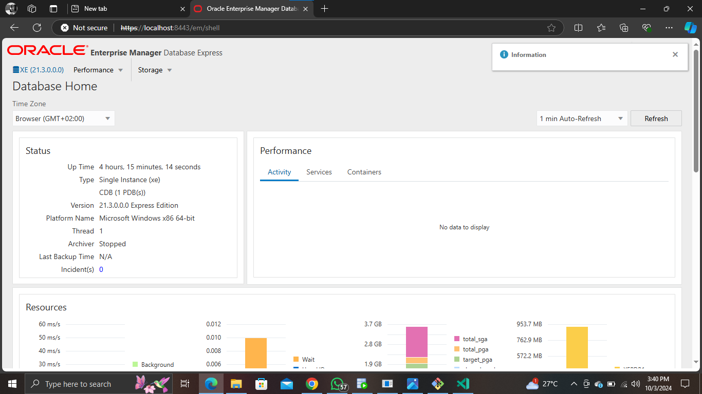

# Managing a Pluggable Database (PDB) in Oracle

This README provides step-by-step instructions for creating, connecting to, and deleting a pluggable database (PDB) in Oracle using SQL queries.

### Prerequisites:
- You need to have access to an Oracle Database with SYSDBA privileges.

- Oracle Multitenant architecture must be enabled (to work with container databases and PDBs).

- The user should know the paths where Oracle data files are stored.

## 1. Creating a New User with All Privileges

The first step is to create a new user with administrative privileges. The following query creates the user C##af_plsqlauca and grants all necessary privileges:

```sql
CREATE USER C##af_plsqlauca IDENTIFIED BY auca;
GRANT ALL PRIVILEGES TO C##af_plsqlauca;
```
- ``C##af_plsqlauca``: The new user’s name. The C## prefix indicates a common user, which can be used in all PDBs.
- ``GRANT ALL PRIVILEGES``: Grants the user all privileges needed to manage databases.


## 2. Creating a Pluggable Database (PDB)

Once the user is created, we proceed to create a new PDB. The PDB will use the user created earlier as its admin user.

### Step 1: Verify the Current Container
Check which container (CDB or PDB) you are currently connected to:

``` sql
SHOW con_name;
```
### Step 2: Switch to the Root Container
To create a PDB, ensure you are operating in the CDB$ROOT container:
``` sql
ALTER SESSION SET container = CDB$ROOT;
```
### Step 3: Create the PDB
Run the following command to create the PDB, specifying the admin user and the file locations:

``` sql
CREATE PLUGGABLE DATABASE af_to_delete_pdb
ADMIN USER af_plsqlauca IDENTIFIED BY auca
FILE_NAME_CONVERT = ('C:\APP\HP\PRODUCT\21C\ORADATA\XE\PDBSEED\', 'C:\APP\HP\PRODUCT\21C\ORADATA\XE\PDBSEED\\no_to_delete_pdb\');
```
- ``af_to_delete_pdb``: The name of the PDB to be created.
- ``ADMIN USER af_plsqlauca``: The admin user for the new PDB.
- ``FILE_NAME_CONVERT``: Specifies the conversion of file paths from the PDB seed (pdbseed) to the new PDB's directory.

## 3. Connecting to the New PDB
After creating the PDB, you need to open and connect to it. Follow these steps:

### Step 1: Switch to the Root Container
Ensure you're in the **CDB$ROOT** container before proceeding:

```sql
ALTER SESSION SET CONTAINER = CDB$ROOT;
```

### Step 2: Connect as SYSDBA
Connect with SYSDBA privileges to manage and open the PDB:
```sql
CONNECT SYS/Mamba024 AS SYSDBA;
```

### Step 3: Open the PDB
The PDB needs to be opened before it can be used:
```sql
ALTER PLUGGABLE DATABASE af_to_delete_pdb OPEN;
```

### Step 4: Switch to the PDB
Once the PDB is opened, switch your session to operate within the new PDB:
```sql
ALTER SESSION SET CONTAINER = af_to_delete_pdb;
```

## 4. Deleting the PDB
### Step 1: Connect as SYSDBA
Ensure you are connected with SYSDBA privileges to delete the PDB:
```sql
CONNECT SYS/Mamba024 AS SYSDBA;
```
### Step 2: Switch to the Root Container
As with PDB creation, operations such as deleting the PDB must be performed in the CDB$ROOT container:
```sql
ALTER SESSION SET CONTAINER = CDB$ROOT;
```
### Step 3: Close the PDB
Before dropping the PDB, it must be closed:
``` sql
ALTER PLUGGABLE DATABASE af_to_delete_pdb CLOSE IMMEDIATE;
```

### Step 4: Drop the PDB
To delete the PDB, use the DROP PLUGGABLE DATABASE command. Use INCLUDING DATAFILES to remove all associated data files:
```sql
DROP PLUGGABLE DATABASE af_to_delete_pdb INCLUDING DATAFILES;
```

### Step 5: Verify PDB Deletion
To verify that the PDB has been deleted, you can query the v$containers view:
```sql
SELECT con_id, name, open_mode FROM v$containers;
```
### Step 5: Oracle Enterprise Manager

